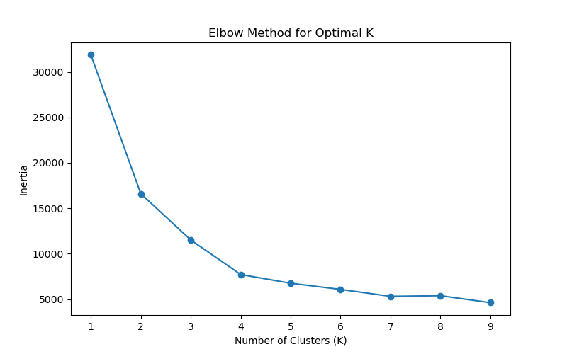
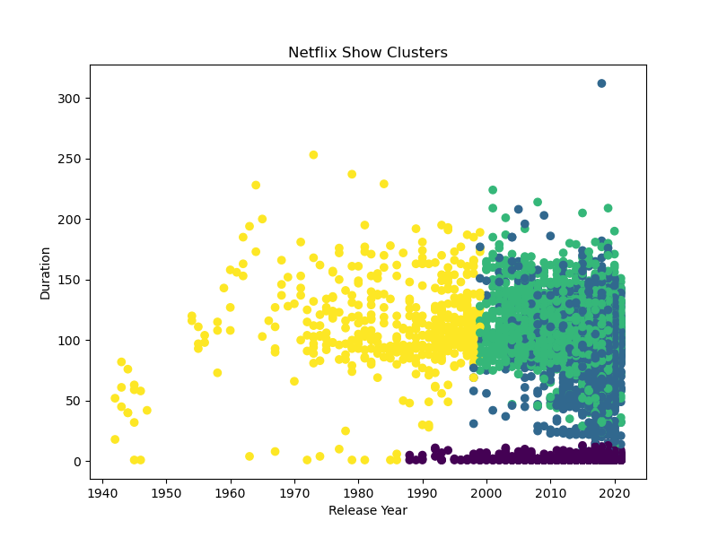
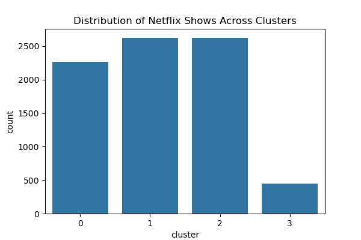
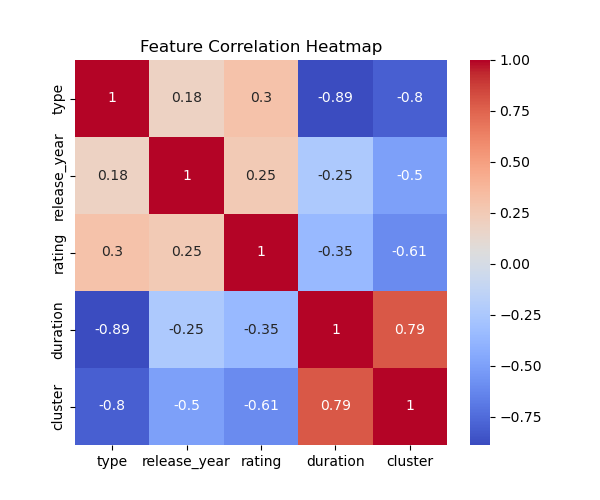

# Netflix Show Clustering using Machine Learning

## Project Overview

This project applies **unsupervised machine learning (K-Means clustering)** to analyze and group Netflix movies and TV shows based on their characteristics.

The goal of the project is to discover patterns within Netflix content by clustering shows with similar attributes such as **type, release year, rating, and duration**.

The project demonstrates a complete **data science workflow**, including:

* Data cleaning
* Feature engineering
* Feature scaling
* Clustering using K-Means
* Visualization of clusters

---

# Objectives

The main objectives of this project are:

* Explore Netflix content data
* Clean and preprocess the dataset
* Convert categorical features into numeric form
* Scale features for machine learning
* Determine the optimal number of clusters using the **Elbow Method**
* Apply **K-Means clustering**
* Visualize and interpret clusters

---

# Technologies Used

* Python
* Pandas
* NumPy
* Matplotlib
* Seaborn
* Scikit-learn
* Jupyter Notebook

---

# Dataset

The dataset contains information about Netflix movies and TV shows.

### Dataset Features

| Column       | Description                             |
| ------------ | --------------------------------------- |
| show_id      | Unique identifier for each show         |
| type         | Movie or TV Show                        |
| title        | Name of the show                        |
| director     | Director name                           |
| cast         | Actors in the show                      |
| country      | Country where the show was produced     |
| date_added   | Date when the show was added to Netflix |
| release_year | Year of release                         |
| rating       | Content rating                          |
| duration     | Duration of movie or number of seasons  |
| listed_in    | Genre                                   |
| description  | Short description                       |

Dataset Source: Kaggle

---

# Project Workflow

The project follows a standard **machine learning pipeline**:

1. Data Loading
2. Data Cleaning
3. Feature Selection
4. Feature Encoding
5. Feature Scaling
6. Finding optimal clusters using Elbow Method
7. Applying K-Means Clustering
8. Cluster Visualization
9. Cluster Interpretation

---

# Data Cleaning

Several preprocessing steps were performed:

* Removed rows with missing values in important columns
* Extracted numeric values from the **duration** column
* Encoded categorical variables such as **type** and **rating**
* Scaled features using **StandardScaler**

These steps ensured the dataset was suitable for clustering.

---

# Feature Engineering

Key features used for clustering include:

* **Type**
* **Release Year**
* **Rating**
* **Duration**

These features help identify similarities between Netflix shows.

---

# Machine Learning Model

## K-Means Clustering

K-Means is an **unsupervised machine learning algorithm** used to group similar data points into clusters.

The algorithm works by:

1. Selecting the number of clusters
2. Assigning each data point to the nearest cluster center
3. Updating cluster centers iteratively until convergence

---

# Finding Optimal Clusters

The **Elbow Method** was used to determine the optimal number of clusters.

It calculates inertia for different cluster values and identifies the point where the rate of decrease slows down.

### Elbow Method Visualization



---

# Cluster Visualization

The clusters were visualized using **release year and duration** to observe how Netflix content groups together.



---

# Cluster Distribution

This visualization shows the number of Netflix shows belonging to each cluster.



---

# Feature Correlation

A correlation heatmap helps understand relationships between different features used in clustering.



---

# Key Insights

Some important observations from the clustering analysis:

* Netflix content can be grouped into clusters based on **release year, rating, and duration**
* Similar shows and movies tend to fall into the same cluster
* Feature scaling improves clustering performance
* Clustering helps identify patterns within Netflix content

---

# Project Structure

Netflix-Show-Clustering

```
Netflix-Show-Clustering
│
├── data
│   └── netflix_titles.csv
│
├── notebooks
│   └── netflix_clustering.ipynb
│
├── images
│   ├── elbow_method.png
│   ├── netflix_clusters.png
│   ├── cluster_distribution.png
│   └── correlation_heatmap.png
│
└── README.md
```

---

# Skills Demonstrated

This project demonstrates several important **Data Science skills**:

* Data Cleaning
* Feature Engineering
* Feature Encoding
* Feature Scaling
* Unsupervised Machine Learning
* K-Means Clustering
* Elbow Method
* Data Visualization

---

# Future Improvements

Possible improvements for this project include:

* Applying **Principal Component Analysis (PCA)**
* Creating an **interactive dashboard**
* Testing other clustering algorithms such as **DBSCAN**
* Building a **recommendation system**

---

# Author

Urvashi Pandey
